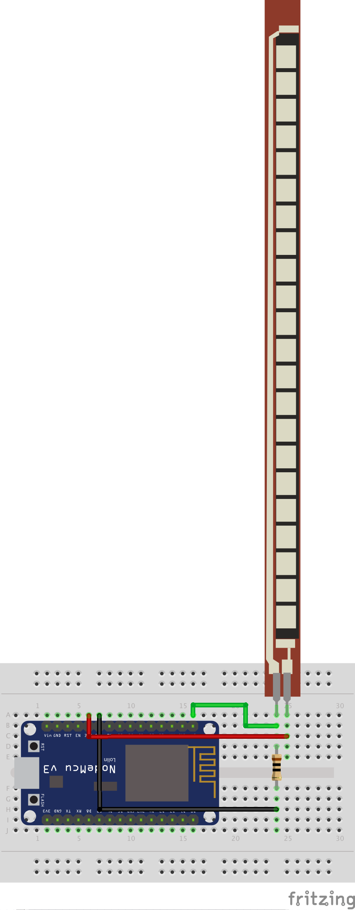
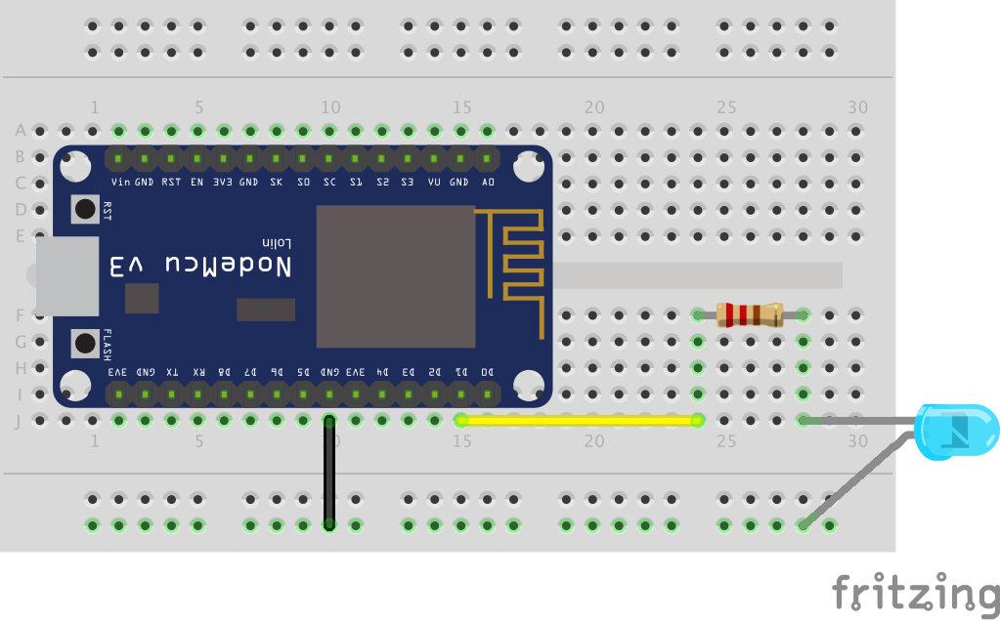
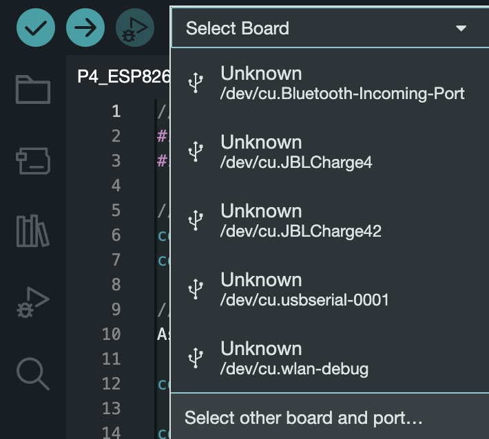
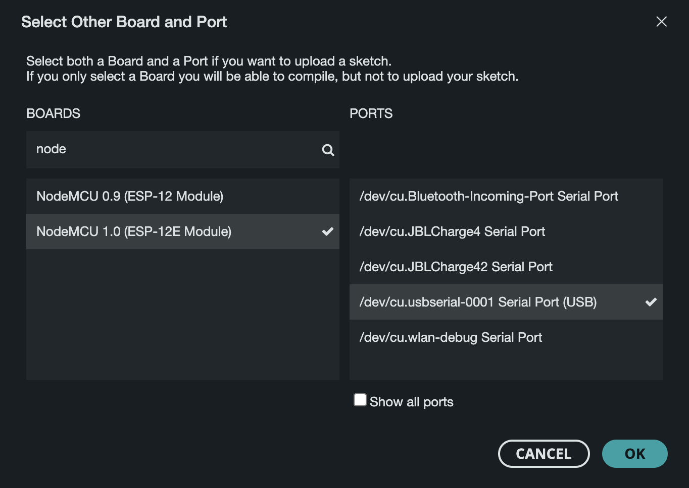
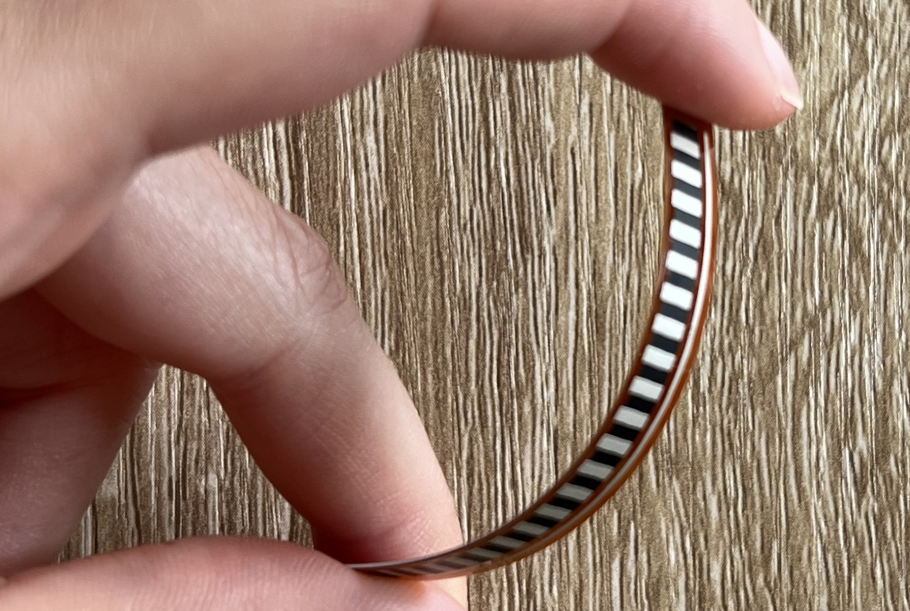

# MVP Moveo

This project demonstrates the wireless data exchange capability between different system elements. It showcases the use of a flex sensor to determine a person's posture. The flex sensor is attached to the wearable on the back of the clothing to monitor posture, and if a slouched posture is detected, it triggers vibration in the wearable attached to the shoe. In the MVP, the LED light serves as a representation of the vibration.

# Components

Included in the project:

- Two NodeMCU boards with ESP8266-12E
- Five jumper wires
- One blue LED
- One Adafruit Short Flex/Bend Sensor (ADA1070)
- One 220KΩ resistor
- One 10KKΩ resistor
- Two breadboards
- Two cables with USB-A and USB micro-B connectors
- One USB-C adapter

# Assembly Instructions

## First Part

Sketch - First Part: Server:

1. Insert the ESP8266 into one of the breadboards.
2. Connect the 10KΩ resistor as shown in "Sketch - First Part: Server".
3. Connect the ground pin of the ESP8266 to the 10KΩ resistor (black jumper wire).
4. Connect the A0 pin of the ESP8266 to the other end of the 10KΩ resistor (green jumper wire).
5. Attach one end of the flex sensor to the A0 pin.
6. Attach the other end of the flex sensor to the 3V3 pin (red jumper wire).

## Second Part

Sketch - Second Part: Client:

1. Insert the ESP8266 into the other breadboard.
2. Connect the ground pin of the ESP8266 to the breadboard (black jumper wire).
3. Connect the 220KΩ resistor as shown in "Sketch - Second Part: Client".
4. Connect the D2 pin of the ESP8266 to one end of the 220KΩ resistor (yellow jumper wire).
5. Connect the LED with the shorter leg to the ground and the longer leg to the resistor.

# Requirements

1. Install the Arduino IDE from https://www.arduino.cc/en/software.
2. Open the Arduino IDE and install the ESP8266 NodeMCU package:
   - Go to Arduino IDE > Preferences and add https://arduino.esp8266.com/stable/package_esp8266com_index.json in the "Additional Board Manager URLs" field, then click OK.
   - Open the Boards Manager via Tools > Boards > Boards Manager.
   - Search for "ESP8266" in the Boards Manager and install "ESP8266 by ESP8266 Community."
3. Restart the Arduino IDE.
4. Two libraries need to be installed manually as they are not available in the Arduino IDE's Library Manager: "ESPAsyncWebServer" and "ESPAsyncTCP."
   - Download the ESPAsyncWebServer library (https://github.com/me-no-dev/ESPAsyncWebServer/archive/refs/heads/master.zip).
   - Download the ESPAsyncTCP library (https://github.com/me-no-dev/ESPAsyncTCP/archive/refs/heads/master.zip).
   - In the Arduino IDE, go to Sketch > Include Library > Add .ZIP Library and select the downloaded libraries.
5. Assemble the components as described in the assembly instructions.
6. Clone the repository: https://github.com/P4CreativeCoding/P4_SS23_Moveo_Team4_Timm.

# Getting Started

- Connect the first part (server) to the laptop using the USB cable and, if necessary, the USB-C adapter.
- Open the P4_ESP8266_server.ino file in the Arduino IDE.
- Select the board and port:

  - Select Board

    

  - Select other board and port

    

  - Select NodeMCU 1.0 Board and Serial Port (USB)

    

- Click on the "Verify" button (blue checkmark), then click on the "Upload" button (blue arrow) to upload the sketch. Finally, open the Serial Monitor (located on the right side, similar to a magnifying glass icon).

  

- Connect the second part (client) to the laptop using the USB cable and, if necessary, the USB-C adapter.
- Open the P4_ESP8266_client.ino file in the Arduino IDE.
- Select the board and port.
- Click on the "Verify" button (blue checkmark), then click on the "Upload" button (blue arrow) to upload the sketch. Finally, open the Serial Monitor (located on the right side, similar to a magnifying glass icon).
- Ensure that both the first part (server) and the second part (client) are powered.
- Bend the flex sensor only in one direction while it is plugged into the breadboard:

- The LED should light up, when the flex-sensor is bend.
